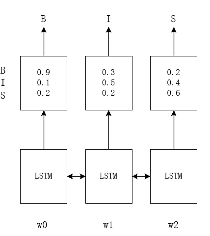
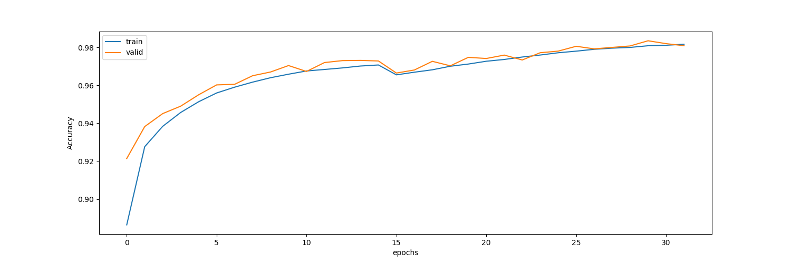
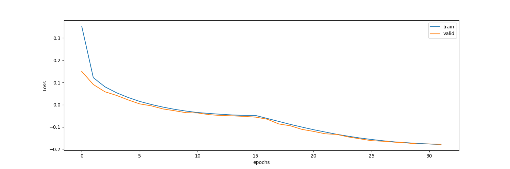

# bi-lstm-crf

基于Universal Transformer的分词模型见:[https://github.com/GlassyWing/transformer-word-segmenter](https://github.com/GlassyWing/transformer-word-segmenter):

## 简介

不同于英文自然语言处理，中文自然语言处理，例如语义分析、文本分类、词语蕴含等任务都需要预先进行分词。要将中文进行分割，直观的方式是通过为语句中的每一个字进行标记，以确定这个字是位于一个词的开头还是之中：

例如“**成功入侵民主党的电脑系统**”这句话，我们为其标注为：

```js
"成功 入侵  民主党 的 电脑系统"
 B I  B I  B I I  S  B I I I
```

其中`B`表示一个词语的开头，`I`表示非一个词语的开头，`S`表示单字成词。这样我们就能达到分词的效果。

对于句子这样的序列而言，要为其进行标注，常用的是使用Bi-LSTM卷积网络进行序列标注，如下图：

<center>
    
    </img>
</center>

通过Bi-LSTM获得每个词所对应的所有标签的概率，取最大概率的标注即可获得整个标注序列，如上图序列`W0W1W2`的标注为`BIS`。但这样有可能会取得不合逻辑的标注序列，如`BS`、`SI`等。我们需要为其设定一些约束，如：

* B后只能是I
* S之后只能是B、S
* ...

而要做到这一点，我们可以在原有的模型基础之上，加上一个CRF层，该层的作用即是学习符号之间的约束（如上所述）。模型架构变为Embedding + Bi-LSTM + CRF，原理参考论文：https://arxiv.org/abs/1508.01991。

## 语料预处理

要训练模型，首先需要准备好语料，这里选用人民日报2014年的80万语料作为训练语料。语料格式如下：

```js
"人民网/nz 1月1日/t 讯/ng 据/p 《/w [纽约/nsf 时报/n]/nz 》/w 报道/v ，/w 美国/nsf 华尔街/nsf 股市/n 在/p 2013年/t 的/ude1 最后/f 一天/mq 继续/v 上涨/vn ，/w 和/cc [全球/n 股市/n]/nz 一样/uyy ，/w 都/d 以/p [最高/a 纪录/n]/nz 或/c 接近/v [最高/a 纪录/n]/nz 结束/v 本/rz 年/qt 的/ude1 交易/vn 。/w "
```

原格式中每一个词语使用空格分开后面使用POS标记词性，而本模型所需要的语料格式如下：

```js
嫌 疑 人 赵 国 军 。    B-N I-N I-N B-NR I-NR I-NR S-W
```

使用命令:

```sh
python tools/data_preprocess.py people-2014/train 2014_processed -c True -s True
```

可将原文件转换为用BIS标签（B:表示语句块的开始，I:表示非语句块的开始，S:表示单独成词）标注的文件。

如上将会使用`people-2014/train`下的文件生成文本文件`2014_processed`

## 生成字典

使用命令：

```python
python tools/make_dicts.py 2014_processed -s src_dict.json -t tgt_dict.json
```

这会使用文件`2014_processed`，生成两个字典文件，`src_dict.json`, `tgt_dict.json`

使用方式见：`python tools/make_dicts.py -h`

## 转换为hdf5格式

使用命令：

```python
python tools/convert_to_h5.py 2014_processed 2014_processed.h5 -s src_dict.json -t tgt_dict.json
```

可将文本文件`2014_processed`转换为hdf5格式，提升训练速度，

使用方式见：`python tools/convert_to_h5.py -h`

## 训练

训练示例见：

```python
train_example.py
```

训练时，默认会生成模型配置文件`data/default-config.json`, 权重文件将会生成在`models`文件夹下。

### 使用字（词）向量

在训练时可以使用已训练的字（词）向量作为每一个字的表征，字（词）向量的格式如下：

```js
而 -0.037438 0.143471 0.391358 ...
个 -0.045985 -0.065485 0.251576 ...
以 -0.085605 0.081578 0.227135 ...
可以 0.012544 0.069829 0.117207 ...
第 -0.321195 0.065808 0.089396 ...
上 -0.186070 0.189417 0.265060 ...
之 0.037873 0.075681 0.239715 ...
于 -0.197969 0.018578 0.233496 ...
对 -0.115746 -0.025029 -0 ...
```

每一行，为一个字（词）和它所对应的特征向量。

汉字字（词）向量来源
可从[https://github.com/Embedding/Chinese-Word-Vectors](https://github.com/Embedding/Chinese-Word-Vectors)获得字（词）向量。字（词）向量文件中每一行格式为一个字（词）与其对应的300维向量。

### 训练效果

训练时模型配置如下：

```json
config = {
        "vocab_size": 6864,
        "chunk_size": 259,
        "embed_dim": 300,
        "bi_lstm_units": 256,
        "max_num_words": 20000,
        "dropout_rate": 0.1
    }
```

其它参数：

| 参数             | 值   |
| ---------------- | ---- |
| batch size       | 32   |
| epochs           | 32   |
| steps_per_epoch  | 2000 |
| validation_steps | 20   |

**注**: 训练未使用词向量

最终效果：

在迭代32次后，验证集精度达到98%




## 分词/解码

1. 编码方式：

    ```python
    import time

    from dl_segmenter import get_or_create, DLSegmenter

    if __name__ == '__main__':
        segmenter: DLSegmenter = get_or_create("../data/default-config.json",
                                src_dict_path="../data/src_dict.json",
                                tgt_dict_path="../data/tgt_dict.json",
                                weights_path="../models/weights.32--0.18.h5")

        for _ in range(1):
            start_time = time.time()
            for sent, tag in segmenter.decode_texts([
                "美国司法部副部长罗森·施泰因（Rod Rosenstein）指，"
                "这些俄罗斯情报人员涉嫌利用电脑病毒或“钓鱼电邮”，"
                "成功入侵民主党的电脑系统，偷取民主党高层成员之间的电邮，"
                "另外也从美国一个州的电脑系统偷取了50万名美国选民的资料。"]):
                print(sent)
                print(tag)
            print(f"cost {(time.time() - start_time) * 1000}ms")

    ```

    `get_or_create`：

    - 参数：
      - config_path: 模型配置路径
      - src_dict_path：源字典文件路径
      - tgt_dict_path：目标字典文件路径
      - weights_path：权重文件路径
    - 返回：
      分词器对象

    `decode_texts`：
    - 参数：
      - 字符串序列（即可同时处理多段文本）
    - 返回：
      - 一个序列，序列中每一个元素为对应语句的分词结果和每个词的词性标签。

2. 命令方式：

    ```python
    python examples/predict.py -s <语句>
    ```

    命令方式所使用的模型配置文件、字典文件等如编程方式中所示。进行分词时，多句话可用空格分隔，具体使用方式可使用`predict.py -h`查看。

### 分词效果展示

1. 科技类

> _物理仿真引擎的作用，是让虚拟世界中的物体运动符合真实世界的物理定律，经常用于游戏领域，以便让画面看起来更富有真实感。PhysX是由英伟达提出的物理仿真引擎，其物理模拟计算由专门加速芯片GPU来进行处理，在节省CPU负担的同时还能将物理运算效能成倍提升，由此带来更加符合真实世界的物理效果。_

```python
['物理', '仿真引擎', '的', '作用', '，', '是', '让', '虚拟世界', '中', '的', '物体运动', '符合', '真实世界', '的', '物理定律', '，', '经常', '用于', '游戏', '领域', '，', '以便', '让', '画面', '看起来', '更', '富有', '真实感', '。', 'PhysX', '是', '由', '英伟达', '提出', '的', '物理', '仿真引擎', '，', '其', '物理模拟计算', '由', '专门', '加速', '芯片', 'GPU', '来', '进行', '处理', '，', '在', '节省', 'CPU', '负担', '的', '同时', '还', '能', '将', '物理运算', '效能', '成', '倍', '提升', '，', '由此', '带来', '更加', '符合', '真实世界', '的', '物理', '效果', '。']
['n', 'n', 'ude1', 'n', 'w', 'vshi', 'v', 'gi', 'f', 'ude1', 'nz', 'v', 'nz', 'ude1', 'nz', 'w', 'd', 'v', 'n', 'n', 'w', 'd', 'v', 'n', 'v', 'd', 'v', 'n', 'w', 'x', 'vshi', 'p', 'nz', 'v', 'ude1', 'n', 'n', 'w', 'rz', 'nz', 'p', 'd', 'vi', 'n', 'x', 'vf', 'vn', 'vn', 'w', 'p', 'v', 'x', 'n', 'ude1', 'c', 'd', 'v', 'd', 'nz', 'n', 'v', 'q', 'v', 'w', 'd', 'v', 'd', 'v', 'nz', 'ude1', 'n', 'n', 'w']
```

2. 政治类

> _昨晚，英国首相特里萨•梅(Theresa May)试图挽救其退欧协议的努力，在布鲁塞尔遭遇了严重麻烦。倍感失望的欧盟领导人们指责她没有拿出可行的提案来向充满敌意的英国议会兜售她的退欧计划。_

```python
['昨晚', '，', '英国', '首相', '特里萨•梅', '(', 'TheresaMay', ')', '试图', '挽救', '其', '退', '欧', '协议', '的', '努力', '，', '在', '布鲁塞尔', '遭遇', '了', '严重', '麻烦', '。', '倍感', '失望', '的', '欧盟', '领导', '人们', '指责', '她', '没有', '拿出', '可行', '的', '提案', '来', '向', '充满', '敌意', '的', '英国议会', '兜售', '她', '的', '退欧', '计划', '。']
['t', 'w', 'ns', 'nnt', 'nrf', 'w', 'x', 'w', 'v', 'vn', 'rz', 'v', 'b', 'n', 'ude1', 'ad', 'w', 'p', 'nsf', 'v', 'ule', 'a', 'an', 'w', 'v', 'a', 'ude1', 'n', 'n', 'n', 'v', 'rr', 'v', 'v', 'a', 'ude1', 'n', 'vf', 'p', 'v', 'n', 'ude1', 'nt', 'v', 'rr', 'ude1', 'nz', 'n', 'w']
```

3. 新闻类

> _印度尼西亚国家抗灾署此前发布消息证实，印尼巽他海峡附近的万丹省当地时间22号晚遭海啸袭击。_

```python
['印度尼西亚', '国家', '抗灾署', '此前', '发布', '消息', '证实', '，', '印尼', '巽他海峡', '附近', '的', '万丹省', '当地时间', '22号', '晚', '遭', '海啸', '袭击', '。']
['nsf', 'n', 'nz', 't', 'v', 'n', 'v', 'w', 'ns', 'nz', 'f', 'ude1', 'ns', 'nz', 'mq', 'tg', 'v', 'n', 'vn', 'w']
```

## 分词评估结果

使用开发集进行评估：

```py
result-(epoch:32):
标准词数：20744，词数正确率：0.939404，词数错误率：0.049653 
标准行数：317，行数正确率：0.337539，行数错误率：0.662461 
Recall: 0.939404
Precision: 0.949798
F MEASURE: 0.944572
ERR RATE: 0.049653
```

## 其它

### 如何评估

使用与黄金标准文件进行对比的方式，进行评估。

1. 数据预处理

    为了生成黄金标准文件和无分词标记的原始文件，可用下列命令：

    ```python
    python examples/score_preprocess.py --corups_dir <评估用语料文件夹> \
    --gold_file_path <生成的黄金标准文件路径> \
    --restore_file_path <生成无标记的原始文件路径>
    ```

2. 读取无标记的原始文件，并进行分词，输出到文件：

    ```python
    python examples/predict.py -f <要分割的文本文件的路径> -o <保存分词结果的文件路径>
    ```

3. 生成评估结果：

    执行`score.py`可生成评估文件，默认使用黄金分割文件`../data/gold.utf8`，使用模型分词后的文件`../data/gold.utf8`，评估结果保存到`../data/prf_tmp.txt`中。

    ```py
    def main():
        F = prf_score('../data/gold.utf8', '../data/gold.utf8', '../data/prf_tmp.txt', 15)
    ```

## 附录

1. 分词语料库： https://pan.baidu.com/s/1EtXdhPR0lGF8c7tT8epn6Q 密码: yj9j
2. 已训练模型权重、配置及字典: https://pan.baidu.com/s/1_IK-e8CDrgaCn-jZqozKJA 提取码: grng